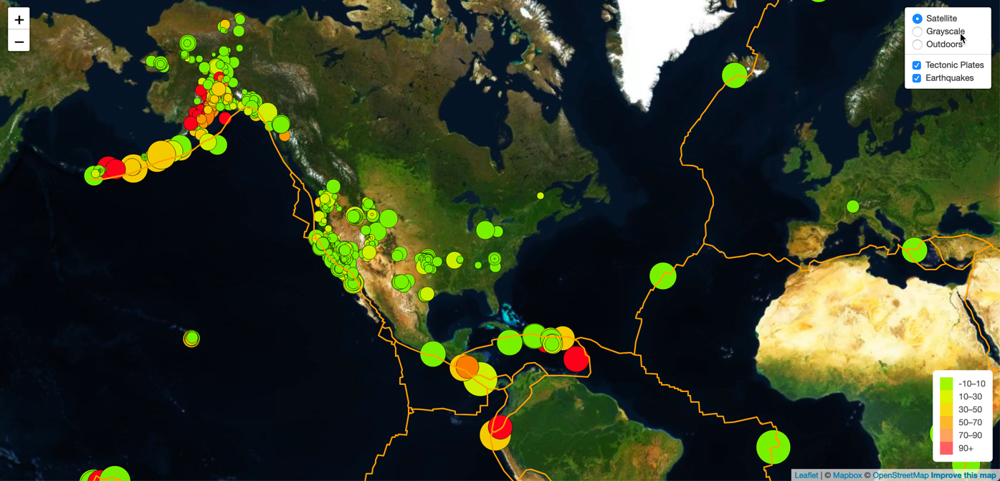

# leaflet-challenge

Welcome to the United States Geological Survey, or USGS for short. The USGS is responsible for providing scientific data about natural hazards, the health of our ecosystems and environment; and the impacts of climate and land-use change. Their scientists develop new methods and tools to supply timely, relevant, and useful information about the Earth and its processes. As a new hire, you will be helping them out with an exciting new project!

The USGS is interested in building a new set of tools that will allow them to visualize their earthquake data. They collect a massive amount of data from all over the world each day, but they lack a meaningful way of displaying it. Their hope is that being able to visualize their data will allow them to better educate the public and other government organizations (and hopefully secure more funding) on issues facing our planet.
### Level 1: Basic Visualization

Visualize an earthquake data set.

1. **Get your data set**

   

   The USGS provides earthquake data in a number of different formats, updated every 5 minutes. It's on [USGS GeoJSON Feed](http://earthquake.usgs.gov/earthquakes/feed/v1.0/geojson.php) page. The data set being represented is "All Earthquakes from the Past 7 Days".

   

2. **Import & Visualize the Data**

   Create a map using Leaflet that plots all of the earthquakes from the data set based on their longitude and latitude.

   * The data markers should reflect the magnitude of the earthquake by their size and and depth of the earthquake by color. Earthquakes with higher magnitudes should appear larger and earthquakes with greater depth should appear darker in color.

   * Include popups that provide additional information about the earthquake when a marker is clicked.

   * Created a legend that will provide context for the map data.

   * The visualization is modeled from the map above.

- - -

### Level 2: More Data (Optional)

The USGS wants you to plot a second data set on your map to illustrate the relationship between tectonic plates and seismic activity. You will need to pull in a second data set and visualize it alongside your original set of data. Data on tectonic plates can be found at <https://github.com/fraxen/tectonicplates>.

* Plotted a second data set on our map.

* Added a number of base maps to choose from as well as separate out our two different data sets into overlays that can be turned on and off independently.

* Added layer controls to our map.